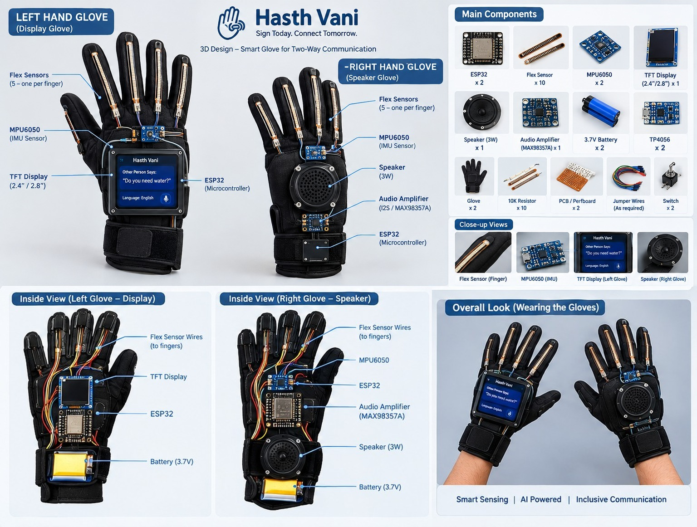
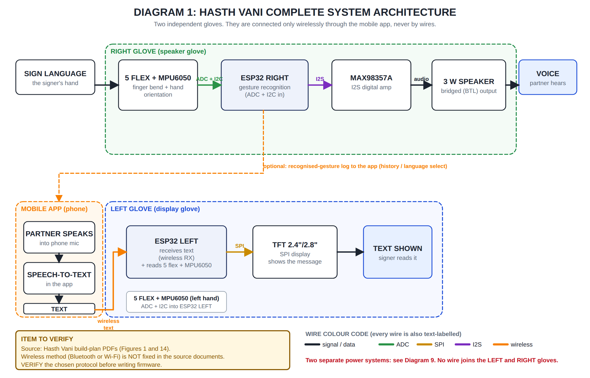

# Hasth Vani

**Two ESP32 smart gloves that give a signing person a voice, and a persistent engineering memory (built on [Hindsight](https://github.com/vectorize-io/hindsight)) that remembers every hardware experiment.**

*Hasth Vani* roughly means "hand voice". *Sign today. Connect tomorrow.*


<sub>Design render of the target build. The working prototype is currently on breadboards; see <a href="#build-status">Build status</a>.</sub>

📝 **Write-up:** [My Glove's Thumb Read 247. Hindsight Remembered Why.](https://dev.to/bnaditya2007boop/my-gloves-thumb-read-247-hindsight-remembered-why-5ml)

---

## The problem

A person who signs and a person who doesn't have no shared channel. Interpreters aren't always available, and typing on a phone breaks eye contact and slows everything down. Hasth Vani puts the translation on the hands themselves:

| Direction | How |
|---|---|
| **Sign → Voice** | The **right glove** reads 5 flex sensors + an MPU6050 IMU, recognises the sign on its ESP32, and speaks it through a MAX98357A amp and speaker. |
| **Voice → Text** | The partner's speech is converted to text and sent wirelessly to the **left glove**, which shows it on a 2.4" TFT. |



---

## Where Hindsight fits: memory for hardware debugging

Hardware bugs don't leave a stack trace. Over a few weeks this build produced:

- a thumb sensor stuck at **~247** while the other fingers read ~2000, **even with the sensor bypassed**
- a TFT library that **wouldn't compile** on ESP32 core 3.x
- a screen that uploads fine and then shows **solid white**
- a breadboard that forced **GPIO33 to fake a 3.3V rail**

Each cost an evening. The dangerous part was forgetting what had already been ruled out. So the project keeps its debugging history in Hindsight, using two operations:

```text
retain -> store a tested observation: sensor, reading, condition, conclusion, next check
recall -> before the next experiment, ask what is already known
```

**The memory never runs on the glove.** The ESP32s only sample ADCs and talk I2C/I2S. They hold no API key and make no cloud calls. The adapter runs on a gateway (laptop now, phone backend later) that already sees the telemetry:

```text
flex sensors / MPU6050 / ESP32 firmware    (real-time, no credentials)
                  │
                  ▼
     gateway: laptop · Raspberry Pi · phone backend
                  │
                  ▼
        memory_service/  ──►  Hindsight  (bank: hasth-vani)
```

### Real recall output

These answers come from the live Hindsight bank after retaining four observations with [`run_demo.py`](memory_service/run_demo.py). The raw JSON is in [`memory_service/evidence/`](memory_service/evidence/).

**Q: "What do we already know about the thumb flex sensor?"**

| Score | Recalled fact |
|---|---|
| 0.621 | The thumb flex sensor on the left glove is reading approximately 247, while other fingers read between 1500 and 2500. |
| 0.166 | The thumb channel measured 247 after a direct 3.3V bypass, but the sensor is not yet confirmed as the faulty component. |
| 0.071 | Bypassing the thumb flex sensor with a jumper direct to 3.3V did not change the reading, indicating the sensor is not the sole cause of the issue. |

**Q: "Why is the TFT screen white?"**

| Score | Recalled fact |
|---|---|
| 1.097 | The 2.4in TFT shield … displays a solid white screen, likely due to an incorrect driver chip configuration in User_Setup.h; the user plans to identify the controller and test alternatives like ILI9325, ILI9328, HX8347, or ST7781. |
| 0.825 | The 2.4in TFT shield … displays a solid white screen despite successful code upload and verification. |

The question doesn't have to match the stored wording. Hindsight split four prose notes into typed, dated facts, so *what was ruled out* and *what to check next* come back as separate answers. That's what stops a test from being repeated.

### Try it (3 commands)

```bash
cd memory_service
pip install -r requirements.txt          # then copy .env.example to .env and add your Hindsight URL + key
python run_demo.py                       # retains the 4 real observations and runs both recalls
```

Or ask it yourself:

```bash
python cli.py recall "What do we already know about the thumb flex sensor?"
```

Tests run offline, with no server needed: `pip install -r requirements-dev.txt && python -m pytest -q tests` (2 passed, [output](memory_service/evidence/pytest.txt)).

---

## Build status

| Piece | Status |
|---|---|
| Flex sensors, left glove | ✅ 4 of 5 fingers read correctly on the rebuilt split-breadboard wiring · ⚠️ thumb reads ~247 (next check: measure the 10k divider resistor, then swap the sensor) |
| MPU6050, left glove | 🔧 I2C scanner and raw-readout sketches ready; not yet confirmed on the rebuilt wiring |
| TFT display, left glove | ✅ Library patched for ESP32 core 3.x, compiles and uploads · ⚠️ screen stays white (next check: identify the real driver chip) |
| Engineering memory (Hindsight) | ✅ Retain/recall working against the live bank, with tests |
| Right glove (flex + MPU) | 🔧 Same circuit as the left glove; not wired yet |
| Speaker (MAX98357A) | 🔧 Code template ready; module not yet in hand |
| Phone app (speech → text) | 📋 Planned |

---

## Engineering notes worth knowing

- **TFT_eSPI on ESP32 core 3.x doesn't compile.** `gpio_input_get()` was removed. Replacing it with `REG_READ(GPIO_IN_REG)` (3 places in `TFT_eSPI_ESP32.c`) fixes it. Full steps are in [`firmware/README.md`](firmware/README.md).
- **Don't fake a supply rail with a GPIO.** The first layout covered the ESP32's 3V3 pin, so GPIO33 was driven HIGH instead, which made finger-to-finger crosstalk hard to reason about. A split breadboard freed the real 3V3 pin. [`flex_diag.ino`](firmware/left_glove/flex_diag.ino) checks each finger in isolation.
- **Power:** 4×AA (~6V) or USB-C into VIN, **never both at once**. 2×AA doesn't give the regulator enough headroom.

---

## Repository

```
├── firmware/        ESP32 sketches for each glove + TFT_eSPI setup notes
├── hardware/        Pin tables, bill of materials, 24 circuit/flow diagrams (SVG), wiring manual (PDF)
├── memory_service/  Hindsight adapter, CLI, demo script, tests, real output in evidence/
├── images/          PNG diagrams and the design render
└── docs/            Full prototype explanation, build plans, interactive wiring viewer
```

- **Interactive wiring viewer:** download [`docs/wiring_3d_viewer.html`](docs/wiring_3d_viewer.html) and open it in a browser. Click any wire or module to isolate it.
- **Pin tables & BOM:** [`hardware/README.md`](hardware/README.md)
- **What's tested vs. untested:** [`firmware/README.md`](firmware/README.md)

---

Built with [Hindsight](https://hindsight.vectorize.io/) by Vectorize. Read more about [agent memory](https://vectorize.io/what-is-agent-memory).
